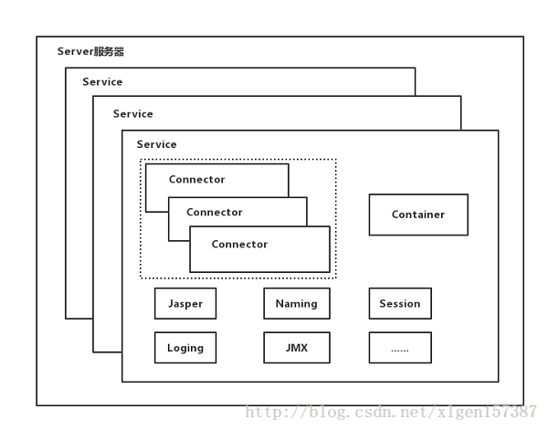
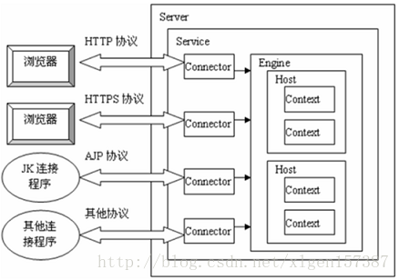
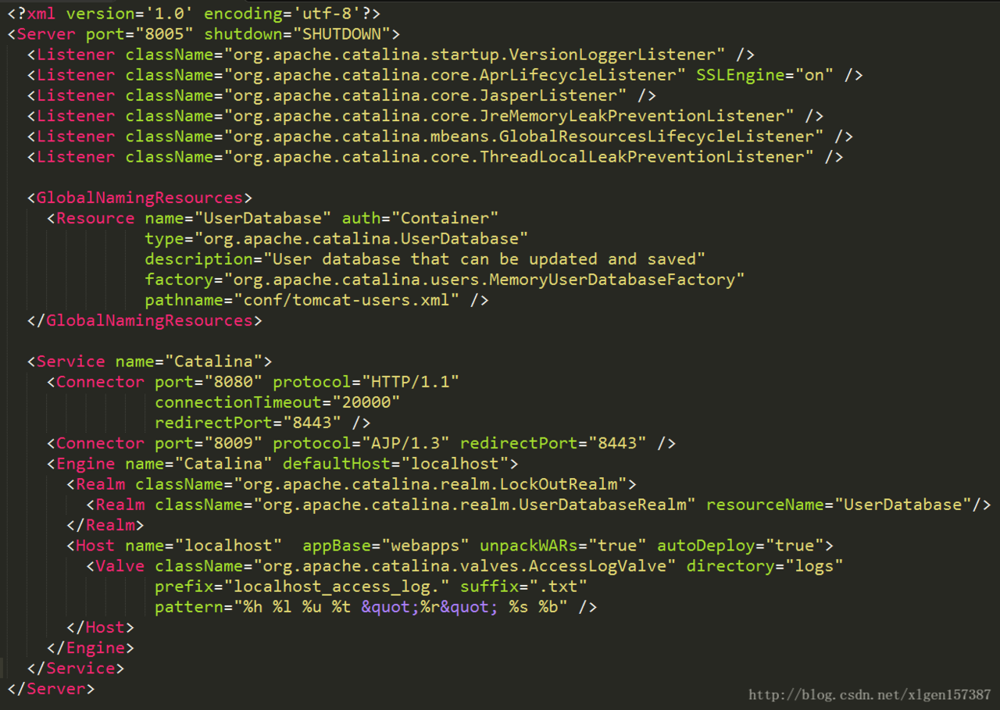
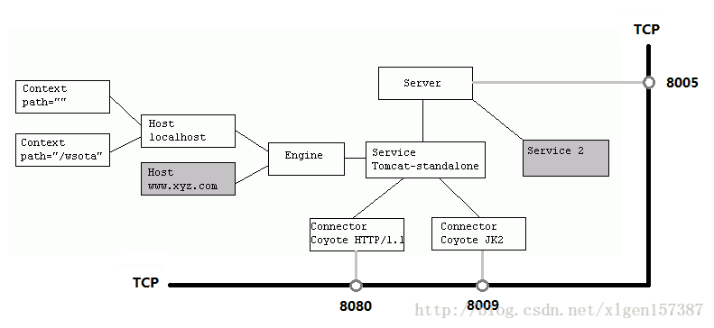
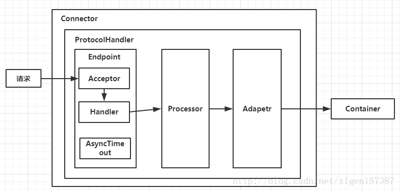
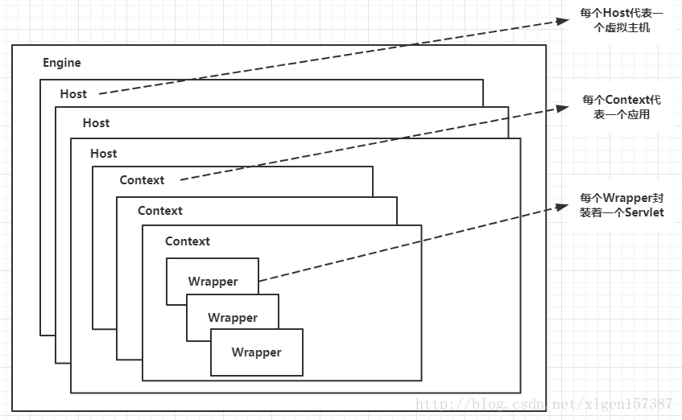
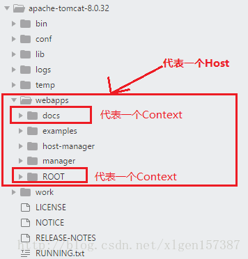
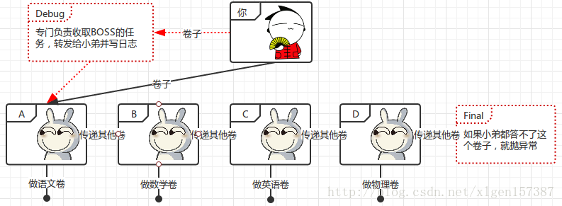
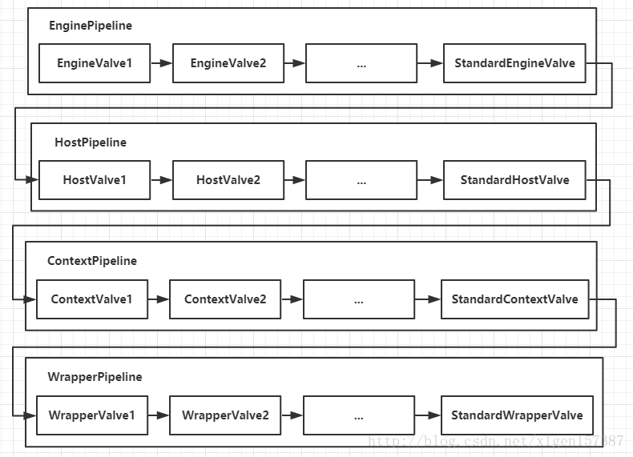

# 架构设计
## 四张图带你了解Tomcat系统架构--让面试官颤抖的Tomcat回答系列！

    Tomcat的结构很复杂，但是 Tomcat 非常的模块化，找到了 Tomcat最核心的模块，问题才可以游刃而解，
    了解了Tomcat的整体架构对以后深入了解Tomcat来说至关重要！

### 一、Tomcat顶层架构

先上一张Tomcat的顶层结构图（图A），如下：



Tomcat中最顶层的容器是Server，代表着整个服务器，从上图中可以看出，一个Server可以包含至少一个Service，用于具体提供服务。

Service主要包含两个部分：Connector和Container。从上图中可以看出 Tomcat 的心脏就是这两个组件，他们的作用如下：

    1、Connector用于处理连接相关的事情，并提供Socket与Request和Response相关的转化;
    2、Container用于封装和管理Servlet，以及具体处理Request请求；

一个Tomcat中只有一个Server，一个Server可以包含多个Service，一个Service只有一个Container，但是可以有多个Connectors，这是因为一个服务可以有多个连接，如同时提供Http和Https链接，也可以提供向相同协议不同端口的连接,示意图如下（Engine、Host、Context下边会说到）：



多个 Connector 和一个 Container 就形成了一个 Service，有了 Service 就可以对外提供服务了，但是 Service 还要一个生存的环境，必须要有人能够给她生命、掌握其生死大权，那就非 Server 莫属了！所以整个 Tomcat 的生命周期由 Server 控制。

另外，上述的包含关系或者说是父子关系，都可以在tomcat的conf目录下的server.xml配置文件中看出，下图是删除了注释内容之后的一个完整的server.xml配置文件（Tomcat版本为8.0）



详细的配置文件文件内容可以到Tomcat官网查看：http://tomcat.apache.org/

上边的配置文件，还可以通过下边的一张结构图更清楚的理解：



Server标签设置的端口号为8005，shutdown=”SHUTDOWN” ，表示在8005端口监听“SHUTDOWN”命令，如果接收到了就会关闭Tomcat。一个Server有一个Service，当然还可以进行配置，一个Service有多个，Service左边的内容都属于Container的，Service下边是Connector。
### 二、Tomcat顶层架构小结：

（1）Tomcat中只有一个Server，一个Server可以有多个Service，一个Service可以有多个Connector和一个Container； 

（2）Server掌管着整个Tomcat的生死大权； 

（4）Service 是对外提供服务的； 

（5）Connector用于接受请求并将请求封装成Request和Response来具体处理； 

（6）Container用于封装和管理Servlet，以及具体处理request请求；

知道了整个Tomcat顶层的分层架构和各个组件之间的关系以及作用，对于绝大多数的开发人员来说Server和Service对我们来说确实很远，而我们开发中绝大部分进行配置的内容是属于Connector和Container的，所以接下来介绍一下Connector和Container。
### 三、Connector和Container的微妙关系

由上述内容我们大致可以知道一个请求发送到Tomcat之后，首先经过Service然后会交给我们的Connector，Connector用于接收请求并将接收的请求封装为Request和Response来具体处理，Request和Response封装完之后再交由Container进行处理，Container处理完请求之后再返回给Connector，最后在由Connector通过Socket将处理的结果返回给客户端，这样整个请求的就处理完了！

Connector最底层使用的是Socket来进行连接的，Request和Response是按照HTTP协议来封装的，所以Connector同时需要实现TCP/IP协议和HTTP协议！

Tomcat既然处理请求，那么肯定需要先接收到这个请求，接收请求这个东西我们首先就需要看一下Connector！
### 四、Connector架构分析

Connector用于接受请求并将请求封装成Request和Response，然后交给Container进行处理，Container处理完之后在交给Connector返回给客户端。

因此，我们可以把Connector分为四个方面进行理解：

（1）Connector如何接受请求的？ 

（2）如何将请求封装成Request和Response的？ 

（3）封装完之后的Request和Response如何交给Container进行处理的？ 

（4）Container处理完之后如何交给Connector并返回给客户端的？

首先看一下Connector的结构图（图B），如下所示：



Connector就是使用ProtocolHandler来处理请求的，不同的ProtocolHandler代表不同的连接类型，比如：Http11Protocol使用的是普通Socket来连接的，Http11NioProtocol使用的是NioSocket来连接的。

其中ProtocolHandler由包含了三个部件：Endpoint、Processor、Adapter。

（1）Endpoint用来处理底层Socket的网络连接，Processor用于将Endpoint接收到的Socket封装成Request，Adapter用于将Request交给Container进行具体的处理。

（2）Endpoint由于是处理底层的Socket网络连接，因此Endpoint是用来实现TCP/IP协议的，而Processor用来实现HTTP协议的，Adapter将请求适配到Servlet容器进行具体的处理。

（3）Endpoint的抽象实现AbstractEndpoint里面定义的Acceptor和AsyncTimeout两个内部类和一个Handler接口。Acceptor用于监听请求，AsyncTimeout用于检查异步Request的超时，Handler用于处理接收到的Socket，在内部调用Processor进行处理。

至此，我们应该很轻松的回答（1）（2）（3）的问题了，但是（4）还是不知道，那么我们就来看一下Container是如何进行处理的以及处理完之后是如何将处理完的结果返回给Connector的？
### 五、Container架构分析

Container用于封装和管理Servlet，以及具体处理Request请求，在Connector内部包含了4个子容器，结构图如下（图C）：



4个子容器的作用分别是：

（1）Engine：引擎，用来管理多个站点，一个Service最多只能有一个Engine； 

（2）Host：代表一个站点，也可以叫虚拟主机，通过配置Host就可以添加站点；

（3）Context：代表一个应用程序，对应着平时开发的一套程序，或者一个WEB-INF目录以及下面的web.xml文件； 

（4）Wrapper：每一Wrapper封装着一个Servlet；

下面找一个Tomcat的文件目录对照一下，如下图所示：



Context和Host的区别是Context表示一个应用，我们的Tomcat中默认的配置下webapps下的每一个文件夹目录都是一个Context，其中ROOT目录中存放着主应用，其他目录存放着子应用，而整个webapps就是一个Host站点。

我们访问应用Context的时候，如果是ROOT下的则直接使用域名就可以访问，例如：www.ledouit.com, 如果是Host（webapps）下的其他应用，则可以使用www.ledouit.com/docs 进行访问，当然默认指定的根应用（ROOT）是可以进行设定的，只不过Host站点下默认的主营用是ROOT目录下的。

看到这里我们知道Container是什么，但是还是不知道Container是如何进行处理的以及处理完之后是如何将处理完的结果返回给Connector的？别急！下边就开始探讨一下Container是如何进行处理的！
### 六、Container如何处理请求的

Container处理请求是使用Pipeline-Valve管道来处理的！（Valve是阀门之意）

Pipeline-Valve是责任链模式，责任链模式是指在一个请求处理的过程中有很多处理者依次对请求进行处理，每个处理者负责做自己相应的处理，处理完之后将处理后的请求返回，再让下一个处理着继续处理。



但是！Pipeline-Valve使用的责任链模式和普通的责任链模式有些不同！区别主要有以下两点：

（1）每个Pipeline都有特定的Valve，而且是在管道的最后一个执行，这个Valve叫做BaseValve，BaseValve是不可删除的；

（2）在上层容器的管道的BaseValve中会调用下层容器的管道。

我们知道Container包含四个子容器，而这四个子容器对应的BaseValve分别在：StandardEngineValve、StandardHostValve、StandardContextValve、StandardWrapperValve。

Pipeline的处理流程图如下（图D）：



（1）Connector在接收到请求后会首先调用最顶层容器的Pipeline来处理，这里的最顶层容器的Pipeline就是EnginePipeline（Engine的管道）；

（2）在Engine的管道中依次会执行EngineValve1、EngineValve2等等，最后会执行StandardEngineValve，在StandardEngineValve中会调用Host管道，然后再依次执行Host的HostValve1、HostValve2等，最后在执行StandardHostValve，然后再依次调用Context的管道和Wrapper的管道，最后执行到StandardWrapperValve。

（3）当执行到StandardWrapperValve的时候，会在StandardWrapperValve中创建FilterChain，并调用其doFilter方法来处理请求，这个FilterChain包含着我们配置的与请求相匹配的Filter和Servlet，其doFilter方法会依次调用所有的Filter的doFilter方法和Servlet的service方法，这样请求就得到了处理！

（4）当所有的Pipeline-Valve都执行完之后，并且处理完了具体的请求，这个时候就可以将返回的结果交给Connector了，Connector在通过Socket的方式将结果返回给客户端。
### 总结

至此，我们已经对Tomcat的整体架构有了大致的了解，从图A、B、C、D可以看出来每一个组件的基本要素和作用。我们在脑海里应该有一个大概的轮廓了！如果你面试的时候，让你简单的聊一下Tomcat，上面的内容你能脱口而出吗？当你能够脱口而出的时候，这位面试官一定会对你刮目相看的！
# 运行模式

两个接口的执行是否对应了2个线程？

如果是这样，是否意味着容器每收到一个请求都会创建1个线程？

有个显而易见的东西，某个request没执行完，也就是没返回response前系统是可以处理其它请求的。

笔者想要确定出现这种情况时，是否是两个不同的线程在分别跑两个接口，想通过测试搞清楚，原理是在两个接口执行过程中把线程地址打出来，通过比较是否一样确定是否是2个线程，将原来的springMVC项目找到2个查询接口。在A接口中间某个程序段加上如下代码块
``` logger.info("A1>>>>>>>>>>>>>>>>>>>>>>>>>>>>>>>>>>>>>>>>>>>>>"+Thread.currentThread());
try {
   Thread.sleep(new Long(10000));
} catch (InterruptedException e) {
   e.printStackTrace();
}
logger.info("A2>>>>>>>>>>>>>>>>>>>>>>>>>>>>>>>>>>>>>>>>>>>>>"+Thread.currentThread());复制代码在B接口中间某个程序段加上如下代码块logger.info("B1>>>>>>>>>>>>>>>>>>>>>>>>>>>>>>>>>>>>>>>>>>>>>"+Thread.currentThread());
try {
   Thread.sleep(new Long(10000));
} catch (InterruptedException e) {
   e.printStackTrace();
}
logger.info("B2>>>>>>>>>>>>>>>>>>>>>>>>>>>>>>>>>>>>>>>>>>>>>"+Thread.currentThread());复制代码然后写了2个测试类，用来模拟http请求，测试类1向A接口发请求，测试类2向B接口发请求使用tomcat启动项目，然后执行测试类1,间隔3秒左右启动测试类2,等待了几秒钟，测试类1，2都分别收到了回复，查看日志，发现打印顺序如下......
A1>>>>>>>>>>>>>>>>>>>>>>>>>>>>>>>>>>>>>>>>>>>>>Thread[http-apr-8090-exec-2,5,main]
......
B1>>>>>>>>>>>>>>>>>>>>>>>>>>>>>>>>>>>>>>>>>>>>>Thread[http-apr-8090-exec-4,5,main]
......
A2>>>>>>>>>>>>>>>>>>>>>>>>>>>>>>>>>>>>>>>>>>>>>Thread[http-apr-8090-exec-2,5,main]
......
B2>>>>>>>>>>>>>>>>>>>>>>>>>>>>>>>>>>>>>>>>>>>>>Thread[http-apr-8090-exec-4,5,main]
...... 
```
复制代码由打印日志不难发现，的确是2个线程那么能否据此推测说容器每接收到1个请求就会创建1个线程呢？

答案是否定的以tomcat为例，暂不考虑其它容器，经过大量的资料查询，发现和tomcat的运行模式有关系，tomcat有3种运行模式，分别是

#### bio模式    
即每1个请求，tomcat都会创建1个线程，现在的tomcat基本都用线程池处理，类似数据库的连接池，提前创建好一定数量的连接，比起请求来了再创建省很多时间。很容易想到，如果并发量很大时，就会需要很多线程，内存肯定很容易溢出的。tomcat配置文件中的Connector节点下默认maxConnections=maxThreads,如果是bio模式，如果想要改变maxThreads(默认75),只需要配置maxThreads
#### nio模式 
maxConnections>maxThreads，即nio模式相对bio模式同等情况下减少了线程数，笔者的理解就是通过某种优化最大化压榨CPU，把时间片都更好利用起来，这里也说明了1个请求未必对应1个线程，之前做过netty项目其通讯就是nio模式,这里附上1篇高质量讲解NIO模式的文章：www.jianshu.com/p/76ff17bc6…,有兴趣可以看下

#### apr 模式  
和nio模式类似，主要区别在于处理静态资源的能力更强如何查看你的项目是什么运行模式？

查看启动日志，会发现类似这样的东西：
```信息: Initializing ProtocolHandler ["http-nio-8090"]
四月 10, 2019 9:16:19 下午 org.apache.tomcat.util.net.NioSelectorPool getSharedSelector
信息: Using a shared selector for servlet write/read
四月 10, 2019 9:16:19 下午 org.apache.coyote.AbstractProtocol init
信息: Initializing ProtocolHandler ["http-bio-8443"]
```
复制代码从日志看出，tomcat在8090端口以nio模式运行，8443端口以bio模式运行3种运行模式的适用情况：

- bio方式基本被淘汰了     
- nio方式适用于连接数多，连接时间短的架构，比如QQ，微信    
- apr方式使用于连接数多,  连接时间长的架构，比如相册服务器，QQ空间相册 

如果不指定，tomcat有默认的运行模式，7.0.30以后默认是apr模式

