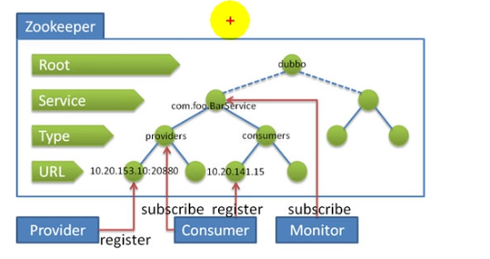
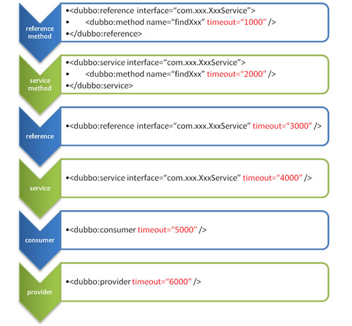

## 分布式
分布式系统是由若干个独立计算机的集合，这些计算机对于用户来说就像单个相关系统。		--分布式系统原理级架构

RPC：远程过程调用，一种进程间通讯方式。
分布式服务框架，极大地简化开发，实时监控服务调用情况，提高集群利用率。

影响RPC框架的效率：

- 能否快速地建立网络通讯连接
- 序列与反序列化机制

它的主要流程是Client -> Client Stub -> Network -> Server Stub -> Server 执行完成之后再进行返回。

比较重要的就是Clint Stub和Server Stub，他们主要的作用就是将调用的方法和参数进行序列化，将序列化后的数据通过网络发送给Server Stub，然后等待Server回执。Server Stub将受到的序列化字节进行反序列化，然后再将参数传入到对应到的方法中执行，将得出的结果计算出来之后再进行返回，返回的过程和正向的过程类似。

Dubbo:一种RPC开源框架。优良特性：

- **面向接口代理的高性能RPC调用**，提供高性能的基于代理的远程调用能力，服务以接口为粒度，为开发者屏蔽远程调用底层细节。
- **智能负载均衡**，内置多种负载均衡策略，智能感知下游节点健康状况，显著减少调用延迟，提高系统吞吐量。
- **服务自动注册与发现**，支持多种注册中心服务，服务实例上下线实时感知。
- **高度可扩展能力**，遵循微内核+插件的设计原则，所有核心能力如Protocol、Transport、Serialization被设计为扩展点，平等对待内置实现和第三方实现。
- **运行期流量调度**，通过配置不同的路由规则，轻松实现灰度发布，增加新功能时只试用一部分服务器。
- **可视化的服务治理与运维**，提供丰富服务治理、运维工具：随时查询服务元数据、服务健康状态及调用统计，实时下发路由策略、调整配置参数。

设计架构

- Provider
暴露服务方称之为“服务提供者”。
- Consumer
调用远程服务方称之为“服务消费者”。
- Registry
服务注册与发现的中心目录服务称之为“服务注册中心”。
- Monitor
统计服务的调用次数和调用时间的日志服务称之为“服务监控中心”。

0. 服务容器负责启动，加载，运行服务提供者。
1. 服务提供者在启动时，向注册中心注册自己提供的服务。
2. 服务消费者在启动时，向注册中心订阅自己所需的服务。
3. 注册中心返回服务提供者地址列表给消费者，如果有变更，注册中心将基于长连接推送变更数据给消费者。
4. 服务消费者，从提供者地址列表中，基于软负载均衡算法，选一台提供者进行调用，如果调用失败，再选另一台调用。
5. 服务消费者和提供者，在内存中累计调用次数和调用时间，定时每分钟发送一次统计数据到监控中心。

注册中心：zookeeper(官方推荐)端口号2181

Zookeeper是Apacahe Hadoop的子项目，是一个属性的目录服务，支持变更推送。

使用流程：

1. 新建一个服务提供者，新建一个服务消费者，面向接口调用，共同依赖同一接口工程
2. 将服务提供者注册到zk，暴露服务
	+ 指定当前服务/应用的名字
	+ 指定注册中心的位置
	+ 指定通信规则（通信协议、通信端口）
	+ 暴露服务，ref为指向服务真正的对象，用Service注解
3. 服务消费者订阅zk的服务
	+ 指定当前服务工程的名字
	+ 指定注册中心的位置
	+ 生成需要调用的远程服务接口，生成远程服务代理，用Reference注解

dubbo2.6之前用的是zkClient，dubbo2.6之后用的是Curator

Apache Curator是一个比较完善的ZooKeeper客户端框架，通过封装的一套高级API 简化了ZooKeeper的操作。Curator主要解决了三类问题：

- 封装ZooKeeper client与ZooKeeper server之间的连接处理
- 提供了一套Fluent风格的操作API
- 提供ZooKeeper各种应用场景(recipe， 比如：分布式锁服务、集群领导选举、共享计数器、缓存机制、分布式队列等)的抽象封装

Curator主要从以下几个方面降低了zk使用的复杂性：

- 重试机制:提供可插拔的重试机制, 它将给捕获所有可恢复的异常配置一个重试策略，并且内部也提供了几种标准的重试策略(比如指数补偿)
- 连接状态监控: Curator初始化之后会一直对zk连接进行监听，一旦发现连接状态发生变化将会作出相应的处理
- zk客户端实例管理:Curator会对zk客户端到server集群的连接进行管理，并在需要的时候重建zk实例，保证与zk集群连接的可靠性
- 各种使用场景支持:Curator实现了zk支持的大部分使用场景（甚至包括zk自身不支持的场景），这些实现都遵循了zk的最佳实践，并考虑了各种极端情况

利用Springoot整合dubbo：

 - 在pom文件引入dubbo-spring-boot-starter
 - 在properties文件中装载相关属性
 - 在服务提供者和消费者中注解Service和Reference，并开启EnableDubbo注解
### 配置
**配置加载顺序及配置覆盖**：

- 虚拟机配置	-Ddubbo protocol.port=20880
- application.xml、properties配置
- dubbo.propertiesde 配置xml文件中的标签名和属性名用.分割

**启动时检查**：先启动服务消费者再启动服务消费者会报异常IllegalStateException（不合法状态）异常，程序终止。可以在服务发现的时候进行注解，check='false'，启动时不检查，真正调用时向注册中心发起请求检查

服务超时：调用远程服务的接口，超时时间默认是1000ms，超时则报错TimeoutException

#### 不同粒度配置的覆盖关系

方法级优先，接口级次之，全局配置再次之。
如果级别一样，则消费方优先，提供方次之。

其中，服务提供方配置，通过 URL 经由注册中心传递给消费方

建议由服务提供方设置超时，因为一个方法需要执行多长时间，服务提供方更清楚，如果一个消费方同时引用多个服务，就不需要关心每个服务的超时设置

### dubbo 支持不同的通信协议
#### dubbo 协议
默认就是dubbo 协议，单一长连接，进行的是 NIO 异步通信，基于 hessian 作为序列化协议。
使用的场景是：传输数据量小（每次请求在 100kb 以内），但是并发量很高。
为了要支持高并发场景，一般是服务提供者就几台机器，但是服务消费者有上百台，可能每天调用量达到上亿次！此时用长连接是最合适的，就是跟每个服务消费者维持一个长连接就可以，可能总共就 100 个连接。然后后面直接基于长连接 NIO 异步通信，可以支撑高并发请求。
长连接，通俗点说，就是建立连接过后可以持续发送请求，无须再建立连接。
dubbo-keep-connection
而短连接，每次要发送请求之前，需要先重新建立一次连接。
dubbo-not-keep-connection

#### rmi 协议
Java 二进制序列化，多个短连接，适合消费者和提供者数量差不多的情况，适用于文件的传输，一般较少用。

#### hessian 协议
hessian 序列化协议，多个短连接，适用于提供者数量比消费者数量还多的情况，适用于文件的传输，一般较少用。

#### http 协议
json 序列化。

#### webservice
SOAP 文本序列化。

### dubbo 支持的序列化协议
dubbo 支持 hession、Java 二进制序列化、json、SOAP 文本序列化多种序列化协议。但是 hessian 是其默认的序列化协议。

**序列化中为什么 PB 的效率是最高的**？

Protocal Buffer 是 Google 出品的一种轻量并且高效的结构化数据存储格式，性能比 JSON、XML 要高很多。主要得益于两个：第一，它使用 proto 编译器，自动进行序列化和反序列化，速度非常快，应该比 XML 和 JSON 快上了 20~100 倍；第二，它的数据压缩效果好，就是说它序列化后的数据量体积小。因为体积小，传输起来带宽和速度上会有优化。

<table style="box-sizing: border-box; outline: 0px; border-spacing: 0px; width: 852px; margin-bottom: 24px; word-break: break-all; color: #333333; font-family: -apple-system, 'SF UI Text', Arial, 'PingFang SC', 'Hiragino Sans GB', 'Microsoft YaHei', 'WenQuanYi Micro Hei', sans-serif, SimHei, SimSun; font-size: 14px;" border="1" cellspacing="1" cellpadding="1">
<tbody style="box-sizing: border-box; outline: 0px; border: 0px; word-break: break-all;">
<tr style="box-sizing: border-box; outline: 0px; border-width: 1px 0px 0px; border-right-style: initial; border-bottom-style: initial; border-left-style: initial; border-right-color: initial; border-bottom-color: initial; border-left-color: initial; border-image: initial; border-top-style: solid; border-top-color: #dddddd; word-break: break-all;">
<td style="box-sizing: border-box; outline: 0px; padding: 8px; margin: 0px; word-break: break-all; border-color: #dddddd; font-size: 14px; color: #4f4f4f; line-height: 16px;">协议名称</td>
<td style="box-sizing: border-box; outline: 0px; padding: 8px; margin: 0px; word-break: break-all; border-color: #dddddd; font-size: 14px; color: #4f4f4f; line-height: 16px;">实现描述</td>
<td style="box-sizing: border-box; outline: 0px; padding: 8px; margin: 0px; word-break: break-all; border-color: #dddddd; font-size: 14px; color: #4f4f4f; line-height: 16px;">连接</td>
<td style="box-sizing: border-box; outline: 0px; padding: 8px; margin: 0px; word-break: break-all; border-color: #dddddd; font-size: 14px; color: #4f4f4f; line-height: 16px;">使用场景</td>
</tr>
<tr style="box-sizing: border-box; outline: 0px; border-width: 1px 0px 0px; border-right-style: initial; border-bottom-style: initial; border-left-style: initial; border-right-color: initial; border-bottom-color: initial; border-left-color: initial; border-image: initial; border-top-style: solid; border-top-color: #dddddd; background-color: #f7f7f7; word-break: break-all;">
<td style="box-sizing: border-box; outline: 0px; padding: 8px; margin: 0px; word-break: break-all; border-color: #dddddd; font-size: 14px; color: #4f4f4f; line-height: 16px;">dubbo</td>
<td style="box-sizing: border-box; outline: 0px; padding: 8px; margin: 0px; word-break: break-all; border-color: #dddddd; font-size: 14px; color: #4f4f4f; line-height: 16px;">传输：mina、netty、grizzy  序列化：dubbo、hessian2、java、json</td>
<td style="box-sizing: border-box; outline: 0px; padding: 8px; margin: 0px; word-break: break-all; border-color: #dddddd; font-size: 14px; color: #4f4f4f; line-height: 16px;">&nbsp;&nbsp;&nbsp; dubbo缺省采用单一长连接和NIO异步通讯&nbsp;&nbsp;&nbsp;</td>
<td style="box-sizing: border-box; outline: 0px; padding: 8px; margin: 0px; word-break: break-all; border-color: #dddddd; font-size: 14px; color: #4f4f4f; line-height: 16px;">1.传入传出参数数据包较小  2.消费者 比提供者多  3.常规远程服务方法调用  4.不适合传送大数据量的服务，比如文件、传视频</td>
</tr>
<tr style="box-sizing: border-box; outline: 0px; border-width: 1px 0px 0px; border-right-style: initial; border-bottom-style: initial; border-left-style: initial; border-right-color: initial; border-bottom-color: initial; border-left-color: initial; border-image: initial; border-top-style: solid; border-top-color: #dddddd; word-break: break-all;">
<td style="box-sizing: border-box; outline: 0px; padding: 8px; margin: 0px; word-break: break-all; border-color: #dddddd; font-size: 14px; color: #4f4f4f; line-height: 16px;">rmi</td>
<td style="box-sizing: border-box; outline: 0px; padding: 8px; margin: 0px; word-break: break-all; border-color: #dddddd; font-size: 14px; color: #4f4f4f; line-height: 16px;">传输：java&nbsp; rmi  序列化：java 标准序列化</td>
<td style="box-sizing: border-box; outline: 0px; padding: 8px; margin: 0px; word-break: break-all; border-color: #dddddd; font-size: 14px; color: #4f4f4f; line-height: 16px;">&nbsp;&nbsp;&nbsp;&nbsp;  连接个数：多连接  连接方式：短连接  传输协议：TCP/IP  传输方式：BIO</td>
<td style="box-sizing: border-box; outline: 0px; padding: 8px; margin: 0px; word-break: break-all; border-color: #dddddd; font-size: 14px; color: #4f4f4f; line-height: 16px;"> 1.常规RPC调用  2.与原RMI客户端互操作  3.可传文件  4.不支持防火墙穿透</td>
</tr>
<tr style="box-sizing: border-box; outline: 0px; border-width: 1px 0px 0px; border-right-style: initial; border-bottom-style: initial; border-left-style: initial; border-right-color: initial; border-bottom-color: initial; border-left-color: initial; border-image: initial; border-top-style: solid; border-top-color: #dddddd; background-color: #f7f7f7; word-break: break-all;">
<td style="box-sizing: border-box; outline: 0px; padding: 8px; margin: 0px; word-break: break-all; border-color: #dddddd; font-size: 14px; color: #4f4f4f; line-height: 16px;">hessian</td>
<td style="box-sizing: border-box; outline: 0px; padding: 8px; margin: 0px; word-break: break-all; border-color: #dddddd; font-size: 14px; color: #4f4f4f; line-height: 16px;"> 传输：Serverlet容器  序列化：hessian二进制序列化 &nbsp;&nbsp;&nbsp;</td>
<td style="box-sizing: border-box; outline: 0px; padding: 8px; margin: 0px; word-break: break-all; border-color: #dddddd; font-size: 14px; color: #4f4f4f; line-height: 16px;"> &nbsp;&nbsp;&nbsp; 连接个数：多连接 &nbsp;&nbsp;&nbsp; 连接方式：短连接 &nbsp;&nbsp;&nbsp; 传输协议：HTTP &nbsp;&nbsp;&nbsp; 传输方式：同步传输  &nbsp;&nbsp;&nbsp;</td>
<td style="box-sizing: border-box; outline: 0px; padding: 8px; margin: 0px; word-break: break-all; border-color: #dddddd; font-size: 14px; color: #4f4f4f; line-height: 16px;"> 1.提供者比消费者多  2.可传文件  3.跨语言传输</td>
</tr>
<tr style="box-sizing: border-box; outline: 0px; border-width: 1px 0px 0px; border-right-style: initial; border-bottom-style: initial; border-left-style: initial; border-right-color: initial; border-bottom-color: initial; border-left-color: initial; border-image: initial; border-top-style: solid; border-top-color: #dddddd; word-break: break-all;">
<td style="box-sizing: border-box; outline: 0px; padding: 8px; margin: 0px; word-break: break-all; border-color: #dddddd; font-size: 14px; color: #4f4f4f; line-height: 16px;">http</td>
<td style="box-sizing: border-box; outline: 0px; padding: 8px; margin: 0px; word-break: break-all; border-color: #dddddd; font-size: 14px; color: #4f4f4f; line-height: 16px;"> 传输：servlet容器  序列化：表单序列化</td>
<td style="box-sizing: border-box; outline: 0px; padding: 8px; margin: 0px; word-break: break-all; border-color: #dddddd; font-size: 14px; color: #4f4f4f; line-height: 16px;">&nbsp;&nbsp;&nbsp; 连接个数：多连接 &nbsp;&nbsp;&nbsp; 连接方式：短连接 &nbsp;&nbsp;&nbsp; 传输协议：HTTP &nbsp;&nbsp;&nbsp; 传输方式：同步传输</td>
<td style="box-sizing: border-box; outline: 0px; padding: 8px; margin: 0px; word-break: break-all; border-color: #dddddd; font-size: 14px; color: #4f4f4f; line-height: 16px;">1.提供者多余消费者  2.数据包混合</td>
</tr>
<tr style="box-sizing: border-box; outline: 0px; border-width: 1px 0px 0px; border-right-style: initial; border-bottom-style: initial; border-left-style: initial; border-right-color: initial; border-bottom-color: initial; border-left-color: initial; border-image: initial; border-top-style: solid; border-top-color: #dddddd; background-color: #f7f7f7; word-break: break-all;">
<td style="box-sizing: border-box; outline: 0px; padding: 8px; margin: 0px; word-break: break-all; border-color: #dddddd; font-size: 14px; color: #4f4f4f; line-height: 16px;">webservice</td>
<td style="box-sizing: border-box; outline: 0px; padding: 8px; margin: 0px; word-break: break-all; border-color: #dddddd; font-size: 14px; color: #4f4f4f; line-height: 16px;"> 传输：HTTP  序列化：SOAP文件序列化</td>
<td style="box-sizing: border-box; outline: 0px; padding: 8px; margin: 0px; word-break: break-all; border-color: #dddddd; font-size: 14px; color: #4f4f4f; line-height: 16px;">&nbsp;&nbsp;&nbsp; 连接个数：多连接 &nbsp;&nbsp;&nbsp; 连接方式：短连接 &nbsp;&nbsp;&nbsp; 传输协议：HTTP &nbsp;&nbsp;&nbsp; 传输方式：同步传输</td>
<td style="box-sizing: border-box; outline: 0px; padding: 8px; margin: 0px; word-break: break-all; border-color: #dddddd; font-size: 14px; color: #4f4f4f; line-height: 16px;"> 1.系统集成  2.跨语言调用</td>
</tr>
<tr style="box-sizing: border-box; outline: 0px; border-width: 1px 0px 0px; border-right-style: initial; border-bottom-style: initial; border-left-style: initial; border-right-color: initial; border-bottom-color: initial; border-left-color: initial; border-image: initial; border-top-style: solid; border-top-color: #dddddd; word-break: break-all;">
<td style="box-sizing: border-box; outline: 0px; padding: 8px; margin: 0px; word-break: break-all; border-color: #dddddd; font-size: 14px; color: #4f4f4f; line-height: 16px;">thrift</td>
<td style="box-sizing: border-box; outline: 0px; padding: 8px; margin: 0px; word-break: break-all; border-color: #dddddd; font-size: 14px; color: #4f4f4f; line-height: 16px;"> &nbsp;&nbsp;&nbsp; 与thrift RPC实现集成，并在基础上修改了报文头&nbsp;&nbsp;&nbsp;</td>
<td style="box-sizing: border-box; outline: 0px; padding: 8px; margin: 0px; word-break: break-all; border-color: #dddddd; font-size: 14px; color: #4f4f4f; line-height: 16px;"> 长连接、NIO异步传输&nbsp;&nbsp;&nbsp;</td>
<td style="box-sizing: border-box; outline: 0px; padding: 8px; margin: 0px; word-break: break-all; border-color: #dddddd; font-size: 14px; color: #4f4f4f; line-height: 16px;">&nbsp;</td>
</tr>
</tbody>
</table>

定时任务框架：
spring task用于单机，定时任务的表达式固定（因为注释的方便，但因此代码也写死了，不能在线修改表达式），定时任务执行的准时度要求不高（里面用的等待队列，有可能会到点推迟执行）。而quartz，就是整合的时候麻烦些并且没有注解功能，一般适用于表达式不固定需要在线修改等等等等。除了注解，task有的quartz都有。非业务类型定时任务可以使用task，业务类型请考虑使用quartz
