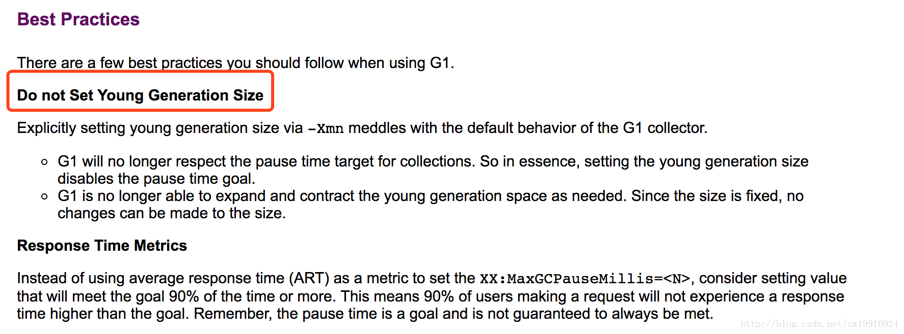

java 的官方文档，里面有个最佳实践里就提到：

里面提到不要设置年轻代大小：

    假若通过 -Xmn 显式地指定了年轻代的大小, 则会干扰到 G1收集器的默认行为.
    G1在垃圾收集时将不再关心暂停时间指标.所以从本质上说,设置年轻代的大小将禁用暂停时间目标. G1在必要时也不能够增加或者缩小年轻代的空间.
    因为大小是固定的,所以对更改大小无能为力.

而我们的程序虚拟机参数刚好就设置了新生代大小：-Xmn2048M。会不会就是这个原因导致的。我先把这个参数和-XX:SurvivorRatio=2 这个参数去掉，然后再部署服务，发现现在垃圾回收变得很正常。
